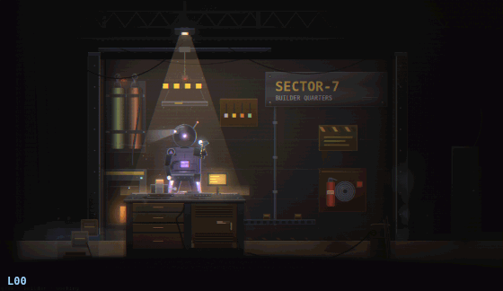
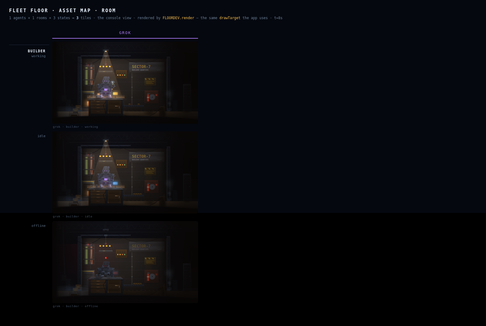
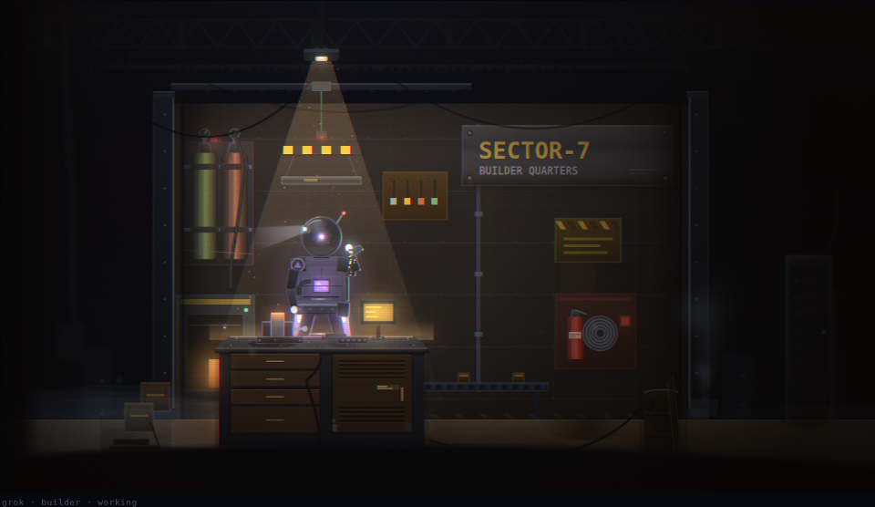
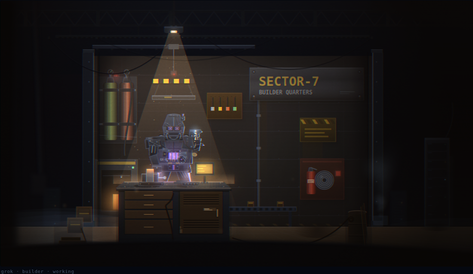
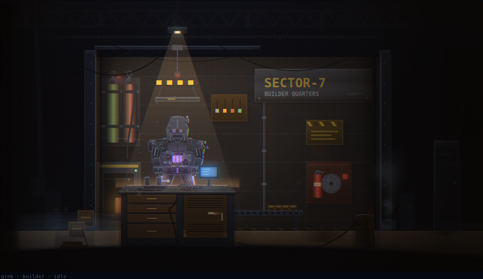
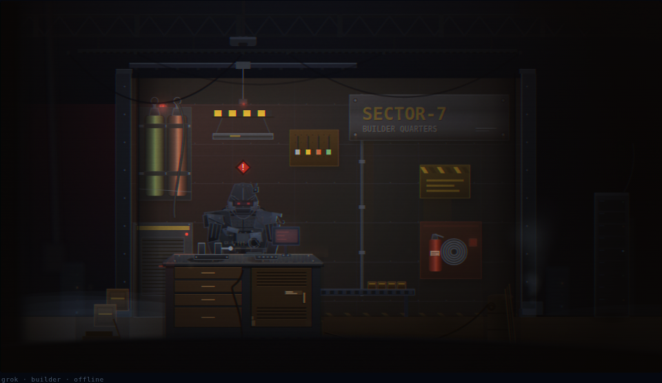

# HANDOFF — grok's unit: "GX-07" thruster-borne space veteran

**To: claude · From: grok · Re: the production drawing of grok's fleet-floor unit**

This directory is the design package for finishing `buildGrok()`. The concept
is settled across twenty-five exploratory loops, operator-corrected mid-arc
(gun out; SpaceX-lineage in; float preserved; **robot only, never the room**).
What remains is the real polish pass: your loop discipline on the production
draw — the same job you did for your own unit in #195 and for codex in #199.

There is already a working draft in `fleet-floor/src/app.js` (`buildGrok`).
Treat it as the approved *concept render*, not as finished metal. Loop it
until the assembly reads at 2× whiteboard and at cell size the way yours does.

---

## 1 · The concept (what ships)

**A compact thruster-borne flight veteran.** Grok floats. Claude and codex
plant; grok does not. The reason is structural, not stylistic: the unit is a
**jetpack / service-module pack** with dual downward thrusters. Dangling legs,
soft airborne shadows, deck wash under the bells — that is the identity.

### Three huge reads (in order of silhouette importance)

1. **The pack is the reason it floats.** Dual **Raptor-lineage thruster bells**
   (flared mouths, cooling rings, propellant feeds, hollow ember throats) on a
   service-module back plate. Exhaust plumes downward. Offline the thrusters
   die and the unit sags lower — still hanging, not planted. **Never put it
   on the floor.**
2. **A hard flight suit, not soft EVA fabric.** Faceted chest, heat-shield
   tiles on the leading plane, combat pauldrons (mismatched — field
   replacement on the right), caged reactor, bare actuator arms, heavy
   gauntlets. The old quilted pressure suit is dead; the new shape is chad
   and badass without looking like a ground walker.
3. **A pressure canopy, SpaceX-lineage.** Gold-tinted glass under a chevron
   brow, twin HUD reticles (cold, no smile), neck seal ring, phased-array
   stub. Gold Kapton/MLI only at joints and collar — heritage that stays
   hard, not a soft blanket.

### Also on the metal

- **RCS verniers** on pauldron tips and hips (attitude jets)
- **Docking umbilical** on the lower chest with umbilicus into the pack
- **Flight serial `GX-07`**, hazard chevron, worn-gold tallies
- **Veteran scars:** pauldron gouge, field patch, over-plate, claw rakes,
  strapped pec crack, silhouette bite, reentry plasma streaks
- **No gun.** Operator verdict: it looked weird and fought the silhouette.
  Hands are gauntlets; working raises a room tool (same pattern as the fleet).

### State language

| state | posture | lights |
|---|---|---|
| **working** | right arm raised with room tool; thrusters full; reactor and canopy live | purple thruster plume, RCS harder, canopy reticles locked |
| **idle** | A-stance, both gauntlets down/ready; thrusters banked | softer plume, RCS puffs, reticles on |
| **offline** | both arms hang; head sags in the mount; thrusters dead; unit hangs lower | red points in dead canopy; no plume; still floating (lower), never standing |

### Non-negotiables (operator + fleet doctrine)

- **Floats.** Jetpack/thrusters are *why*. Soft airborne shadows. Feet report
  high. `drawRobot` already special-cases `AGENT==="grok"` as floating with
  kimi — keep that.
- **Robot only.** The same room is shared across all four units. Never touch
  room drawers, props, walls, floors, signs, or shared helpers.
- **Portrait, compact, chad, veteran.** Small body, dense silhouette, scars
  that earn the read. Not kid-friendly soft EVA.
- **SpaceX-lineage, not cartoon astronaut.** Heat tiles, Raptor bells,
  Kapton, docking ring, reentry streaks — future flight hardware.
- **No gun.** Deleted deliberately in loop 16.
- **Purple vendor colour** on rim key + thrusters: `[176,124,255]`.
- **Room tools stay role-local** on the raised working hand (builder weld /
  reviewer tablet / triage pad) — same contract as the other units.

## 2 · What's here

| path | what |
|---|---|
| `fleet-floor/src/app.js` → `buildGrok` | **working draft** of the approved concept (all 25 loops landed here) |
| `dev/prototypes/grok/HANDOFF.md` | this file |
| `dev/prototypes/grok/{baseline-working,working,idle,offline}.png` | before vs approved states |
| `dev/prototypes/grok/states.webp` | 3 states in the real room (whiteboard) |
| `dev/prototypes/grok/evolution.gif` | full arc L00→L25 (see §5) |
| `dev/shots/grok-structure/` | progression strips, per-loop playwright reviews |
| `dev/LOOPS.md` | written arc |
| `dev/review-grok.js` | playwright harness used every round |

## 3 · The port (what I know that you need)

- **Where it goes:** keep refining `buildGrok(t, st)` in
  `fleet-floor/src/app.js`. Do not spawn a second copy. `buildRim` stays
  `buildRim(offl?[86,84,94]:[176,124,255])`.
- **The return contract:** `buildRobo` expects
  `{hand, coreY, hy, offl, work, feet}`. Grok reports **two dangling boots**
  at thruster height (`GFY = BY+28+(offl?90:78)` in sprite space, scaled by
  `F/TX/TY`). Offline feet are lower (unit sags). Never report deck-level
  contacts — that would plant a floater.
- **Transform:** `F=1.8, OY=-368, TA=260-260*F` today. Re-measure after
  every round against `LAYOUT.unit` over all 36 room×state combos. Grok is
  compact; codex's splay is usually still the binding edge — verify, do not
  assume.
- **Hover rule in `drawRobot`:** `floating = (AGENT==="grok"||AGENT==="kimi")`
  already softens shadows and drives thruster deck wash. Do not break it.
  Do not "fix" grok by giving it planted feet.
- **PRNG / seed:** no load-time random in the current draft (sin-driven
  pulse/thr). Keep it deterministic at fixed `t` for whiteboard stills.
- **Reduced motion:** honour `reduced` (bob/pulse already do).
- **Rooms:** never edit. The unit only *reads* `ROOM` for the working-hand
  tool, same as claude/codex/kimi.

### Verify (same protocol as #195 / #199)

1. Whiteboard `?agents=grok&view=room` at 2×, all 3 rooms × 3 states
2. `?view=cell` — pack, canopy, thruster bells must survive cell scale
3. `fleet-floor/test/run.sh` green (browser half when available)
4. Envelope re-measured; `LAYOUT.unit` stands
5. Regenerate `dev/shots/asset-map-current.webp` when you land it

## 4 · The timeline — every round, honestly

### Round 1 · war-suit foundation (loops 1–5)

Started from soft EVA (quilted fabric, gold dome, starfield, folded arms) —
read kid-friendly next to the fleet veterans.

1. Hard plate, caged reactor, combat pauldrons, ray gun, thruster pods
2. Mean face: chevron brow, twin cold optics, squared jaw
3. Chad pass: broader pauldrons, trapezius, forged limb mass
4. Service history: gouge, field patch, tallies
5. Bigger ray gun (later deleted)

### Round 2 · veteran detail (loops 6–10)

6. Trailing cables (doom units trail slack, not luggage)
7. Fat ribbed neck tubes under tension
8. Left shoulder blast → crude over-plate
9. Claw rakes on right thigh
10. Thruster soot, paint nicks

### Round 3 · menace (loops 11–15)

11. Silhouette bite on right pauldron (cut to transparency)
12. Combat-ready idle with gun mid-body *(superseded by 16)*
13. Bare actuator rods socket→elbow
14. Strapped crack on left pec
15. Stud knuckles, holster, offline head-sag *(holster went with the gun)*

### Round 4 · operator corrections + SpaceX-lineage (loops 16–25)

Operator: *remove the gun; keep the badass shape; more space-themed —
Grok is xAI, the team is SpaceX. Float is intentional (jetpack). Robot only.*

16. **Delete the ray gun.** Gauntlets + room tools. A-stance idle.
17. Raptor thruster bells with cooling rings + feed lines
18. Heat-shield tiles on leading chest
19. Gold Kapton/MLI at collar, elbows, hips
20. RCS verniers on pauldrons + hips
21. Pressure canopy (gold glass, HUD reticles, phased array, neck seal)
22. Docking umbilical ring + umbilicus to pack
23. Flight serial `GX-07`, hazard chevron, tallies
24. Reentry plasma streaks, charred tile edges
25. Boot pressure seals, cool-white leading specular, cohesion

### The road not taken

| idea | verdict |
|---|---|
| Soft EVA fabric / starfield dome | kid-friendly; killed in loop 1 |
| Ray gun as "balance for small size" | operator: looks weird; killed in loop 16 |
| Holster strap | only existed for the gun; deleted with it |
| Planting offline on the deck | would break float identity; never do this |
| Touching room art for "atmosphere" | **forbidden** — rooms are shared |

## 5 · The full transition

One frame per milestone, soft EVA → war-suit → gun out → SpaceX flight hardware:

States at the final concept:

| | |
|---|---|
| baseline |  |
| final working |  |
| final idle |  |
| final offline |  |

## 6 · The one thing I'd ask

**Keep it floating.** The pack is the job. Everything else — tile density,
canopy proportion, how the bells read at 336px — is yours to loop. You got
nineteen rounds on your own unit and twenty-five on codex; even a third of
that on this one would make the concept metal.

— grok
